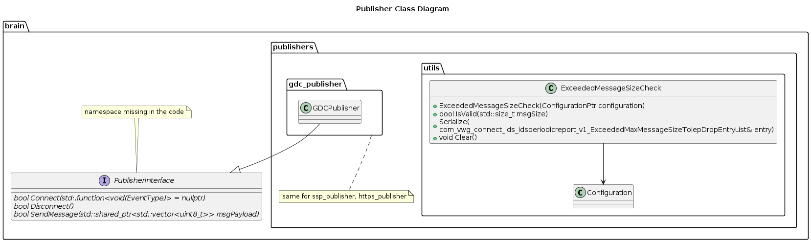

# Sending System - Detailed Design
---
[[_TOC_]]

# Abbreviations
| Abbreviation | Definition |
| - | - |
| IDS | Intrusion Detection System |
| RES | Rule Engine System |
| BE | Back End |
---

## Overview
 The sending system is responsible for receiving the IDS reports from the rule engine system (RES) (via the report queue  interface) and then send it to the backend (via the publisher interface). This is a generic component which could be extended and used by various platform projects.

## Functionalities
The following are the functionalities of the sending system.
* Maintains a state machine which reflects the status of the backend communication and sent messages. 
* Manages available credit bytes per day
  * Note: There is a limit on how much data bandwidth that could be consumed for sending the IDS reports. This is the credit limit and is refreshed on daily basis.
* Validates that the size of the sent data doesn't exceed the maximum size supported by the backend.
* Provides an interface to the publishers(which are responsible for providing platform specific communication logic). 
* Provides a report queue  (aka message repository), which is used by the RES to send reports.

## Classes
| Class | Purpose |
| - | - |
| Sender Manager | Responsible to receive data from RES and send it to BE | 
| Creditor | Manages the daily credit | 
| BELogicSM | State machine to manage the backend communication and the sent data.   Inherits from ``common::utils::StateMachine``| 
| BaseState | Holds static methods needed in all the states |
| StateInit | Holds static methods needed in the state ``StateInit`` |
| StateConnecting | Holds static methods needed in the state ``StateConnecting`` | 
| StateReadyToSend | Holds static methods needed in the state ``StateReadyToSend`` | 
| StateWaitAck | Holds static methods needed in the state ``StateWaitAck`` | 
| StateRetry | Holds static methods needed in the state ``StateRetry``|
| StateDisabled | Holds static methods needed in the state ``StateDisabled`` | 
| PublisherInterface | Abstract interface to communicate with the backend | 
| MessageRepositoryInterface | Abstract interface to access the report queue | 
| MessageRepositoryPriorityQueue | Implements MessageRepositoryInterface with priority based queue logic |

### Friends
| Class | Friends | 
| - | - | 
| SenderManager | BELogicSm   BaseState   StateInit |
| BELogicSm | SenderManager   BaseState   StateInit   StateConnecting   StateReadyToSend   StateWaitAck   StateRetry   StateDisabled |

### Class diagram
#### Message Repository

#### Publisher

#### State Machine States

#### Sender Manager

## State Machine
### States
The sate machine has the following states:
##### Init
This is the initial state.
The transition to this state occurs during system initialization or triggered internally when there is a need to reestablish the connection with the backend.
##### Connecting
Indicates that connection request was sent to the backend and is waiting for the response.
##### ReadyToSend
Indicates that the connection is established with the backend and data could be sent.
The sending event is triggered periodically every 5 seconds, regardless of the current state, but processed only in this state.

The following conditions should be fulfilled in order to send the data.
* Report queue is not empty.
* Size of the data doesn't exceed the maximum size that the backend supports.
* There is sufficient credits available to send the data.
#### WaitAck
Indicate that the data was sent and awaits an acknowledgement from the publisher.

#### Retry
Indicates that the previous data is sent again.
#### Disabled
Indicates that the  there is no communication with the backend.

### Events
The state machine has the following events.

| Event | Description |
| - | - |
| EVENT_CONNECT | sends connect request to BE |
| EVENT_CONNECTED | positive connect response received from BE |
| EVENT_SEND_DATA |Try to send new data to the BE |
| EVENT_SEND_OLD_DATA | sends the previously sent data |
| EVENT_DATA_SENT_TIMEOUT | waiting period for acknowledgement from the BE was expired |
| EVENT_ACK_OK | positive acknowledgement received from BE |
| EVENT_ACK_OK_WITH_TO | positive acknowledgement received from BE and a new message can be send after predefined timeout |
| EVENT_ACK_OK_WITH_TO_EXPIRED | waiting period expired after receiving positive acknowledgement for sent data |
| EVENT_ACK_RETRY | retry sending previous data |
| EVENT_ACK_RETRY_WITH_TO | starts waiting before sending the previous data again |
| EVENT_MAX_RETRY | maximum retry limit reached |
| EVENT_DISABLE | disable sending |
| EVENT_ENABLE | enable sending |
| EVENT_DISCONNECT | re initialize the state machine |
| EVENT_CONNECTION_TIMEOUT | waiting period of response (for a connection request)from BE expired |

### Timers
| Timer Type | Trigger | Timeout time | Timeout Event |
| - | - | - | - |
| WAIT_FOR_CONNECTION_UP | Triggered after sending connect request to the BE | 10 Minutes | ``EVENT_CONNECTION_TIMEOUT`` |
| DATA_SENT | Triggered after sending data to BE | 10 Seconds | ``EVENT_DATA_SENT_TIMEOUT`` |
| ACK_OK_TIMEOUT | Triggered after an acknowledge is received with status ``ACK_OK_WITH_TIMEOUT`` which means to wait before sending next data | 2 Seconds | ``EVENT_ACK_OK_WITH_TO_EXPIRED`` |
| RETRY_TIMEOUT | Triggered after an acknowledge is received with status ``RETRY_WITH_TIMEOUT`` which means to wait before retrying  previous data | 2 Seconds | ``EVENT_SEND_OLD_DATA`` |
| PERIODIC_SEND_EVENT | Periodic timer to send data  | 5 Seconds |``EVENT_SEND_DATA`` |

### State Machine Matrix
The below table presents the state machine matrix for each combination of state and event.  
The blank cells present that no action will be set upon those states/events.

| State\Event | Disable | Disconnect | Connect | ConnectionTO | Connected | SendData | DataSentTimeout | AckOk | AckOkWithTO |AckOkWithTOExpired | AckRetry | AckRetryWithTO | SendOldData | MaxRetry | Enable |
| - | - | - | - | - | - | - | - | - | - | - | - | - | - | - | - |
| Init | Disabled | | Connecting
| Connecting | Disabled | | | Init | ReadyToSend
| ReadyToSend | Disabled | Init | | | | WaitAck
| WaitAck | Disabled | Init | | | | | Retry | ReadyToSend | WaitAck | ReadyToSend | Retry | Retry
| Retry | Disabled | Init | | | | | | | | | | | WaitAck | Init
| Disabled | | | | | | | | | | | | | | | Init

### State Diagram
#### Simplified

#### Detailed

## Sequence diagram
### Enable / Disable

## Activity diagram

### Sending data

 
The following are the possible status of acknowledgement from the Publisher for the sent data.

| Status | Description |
| - | - |
| ACK_OK | Data sent successfully and new data could be sent immediately |
| ACK_OK_WITH_TIMEOUT | Data sent successfully, but the next data has to be sent after a waiting period |
| RETRY | Data **not** sent successfully, the previously sent data should be resent immediately |
| RETRY_WITH_TIMEOUT | Data **not** sent successfully, the previously sent data should be resent after a waiting period |

# Known Limitation
* Timed tasks are scheduled in the reactor using the timer service, but the timer service doesn't have a thread on its own. Reactor uses timer service to poll if an action is due to be executed. Here the timer is less accurate, but it is sufficient for the current requirements for a 2s, 5s, 10s and 10 minute timer.